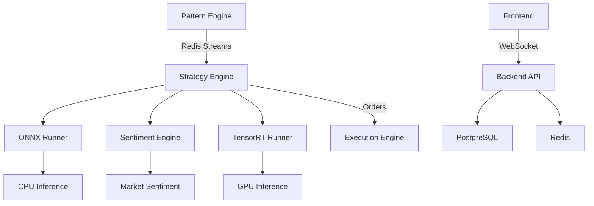

# AITrader Project Status Overview

*Last Updated: September 29, 2025*

## 📊 **Comprehensive Service Status Matrix**

| Component | Core Function | UI Integration | Docker Integration | Production Ready | Port | Status |
|-----------|---------------|----------------|-------------------|------------------|------|--------|
| **Frontend** | ✅ Complete | ✅ Complete | ✅ Complete | ⚠️ Needs Hardening | 8080/5173 | **Beta** |
| **Backend API** | ✅ Working | ✅ Complete | ✅ Complete | ⚠️ Needs Testing | 8000 | **Beta** |
| **Pattern Engine** | ✅ Working | ✅ Complete | ✅ Complete | ⚠️ Basic Algorithms | Redis Streams | **Alpha** |
| **Strategy Engine** | ✅ Working | ✅ Complete | ✅ Complete | ⚠️ ML Integration Testing | 8005 | **Alpha** |
| **ONNX Runner** | ✅ Working | ⚠️ Partial | ✅ Complete | ❌ Needs Optimization | 8001 | **Alpha** |
| **Sentiment Engine** | ⚠️ Basic | ⚠️ Partial | ✅ Complete | ❌ Limited Implementation | 8002 | **Prototype** |
| **TensorRT Runner** | ⚠️ Framework | ❌ Not Connected | ✅ Complete | ❌ Development Only | 8007 | **Framework** |
| **Mock MCP** | ✅ Complete | ✅ Complete | ✅ Complete | ✅ Ready | 9000 | **Production** |
| **Execution Engine** | ❌ Planned | ❌ Planned | ⚠️ Stub | ❌ Not Started | 8006 | **Planned** |

### 📋 **Status Legend**
- **✅ Complete**: Fully implemented and working
- **⚠️ Partial/Needs Work**: Implemented but requires improvements
- **❌ Not Started/Missing**: Not yet implemented or major issues
- **Production**: Ready for production use
- **Beta**: Core functionality complete, needs production hardening
- **Alpha**: Working prototype, needs significant development
- **Prototype**: Basic implementation, proof of concept
- **Framework**: Scaffolding in place, implementation needed
- **Planned**: Design complete, implementation pending

## 🚀 **Development Environment Status**

### Quick Start Scripts
| Script | Purpose | Status | Port | Use Case |
|--------|---------|--------|------|----------|
| `./hostexecs/quick-start.sh` | Local frontend development | ✅ Ready | 5173 | Fastest iteration |
| `./hostexecs/dev-frontend.sh` | Docker frontend development | ✅ Ready | 8080 | UI work with Docker |
| `./hostexecs/dev-fullstack.sh` | Complete development stack | ✅ Ready | 8080/8000 | Full stack development |
| `./hostexecs/production.sh` | Production deployment | ✅ Ready | 80/8000 | Production testing |

### Docker Compose Configurations
| File | Purpose | Services | Status |
|------|---------|----------|--------|
| `docker-compose.frontend-only.yml` | Frontend development | Frontend only | ✅ Working |
| `docker-compose.production.yml` | Complete system | All 16+ services | ✅ Working |
| `docker-compose.gpu.yml` | GPU acceleration | ML services with GPU | ⚠️ Requires GPU setup |  
- **Features**: Basic FinBERT sentiment analysis
- **Needs**: Multi-source data integration, real-time processing, accuracy improvements

### TensorRT Runner (Port 8007)
- **Status**: Framework - Development Ready
- **Features**: TensorRT engine scaffolding with fallbacks
- **Needs**: GPU context management, model optimization, production deployment

## 📋 **Planned**

### Execution Engine (Port 8006)
- **Status**: Planning
- **Purpose**: Order management, risk controls, broker integration

### Pattern Engine (Python → Future Rust)
- **Status**: ✅ Python implementation complete and functional
- **Purpose**: Pattern detection and signal generation
- **Future**: Rust migration planned for ultra-low latency production use

## 📚 **Documentation Structure**

| File | Purpose | Status |
|------|---------|--------|
| `docs/architecture/BACKEND_ARCH.md` | Architecture overview | ✅ Complete |
| `docs/architecture/BACKEND_INTERFACES.md` | API specifications | ✅ Complete |
| `docs/services/BACKGROUND_INSTRUCTIONS.md` | Development guidance | ✅ Updated |
| `docs/architecture/SERVICE_MAP.md` | Visual service topology | ✅ Complete |
| `docs/services/STRATEGY_ENGINE_ML_INTEGRATION.md` | ML integration details | ✅ Complete |
| `docs/frontend/FRONTEND_INSTRUCTIONS.md` | Frontend development | ✅ Complete |
| `docs/instructions/copilot-instructions.md` | AI development guidelines | ✅ Updated |

## 🚀 **Quick Start Commands**

### Full System
```bash
docker compose up --build
```

### Core Services Only
```bash
docker compose up --build postgres redis mock-mcp
```

### Enhanced Strategy Engine
```bash
docker compose up --build strategy_engine pattern_engine onnx_runner sentiment_engine
```

### Health Checks
```bash
curl http://localhost:8000/health  # Main backend
curl http://localhost:8005/health  # Strategy engine
curl http://localhost:8001/health  # ONNX runner
curl http://localhost:8002/health  # Sentiment engine
```

## 🔍 **Recent Achievements**

1. **ML Service Integration**: Strategy Engine now connects to ONNX Runner, Sentiment Engine, and TensorRT Runner
2. **Dual-Path Inference**: Automatic failover from GPU to CPU inference ensures system reliability
3. **Enhanced Decision Making**: 8-factor analysis combining technical indicators, ML predictions, and sentiment
4. **Complete Documentation**: Comprehensive service map and architecture documentation
5. **Pattern Engine Implementation**: Real-time signal generation with EMA/VWAP pattern detection

## 📊 **Architecture Highlights**



## 🎯 **Next Priority Actions**

1. **Test ML Integration**: Verify end-to-end signal flow
2. **Optimize Performance**: Tune ML service timeouts and batch processing
3. **Real Data Integration**: Connect to live market data feeds
4. **Execution Engine**: Implement order management system
5. **Monitoring**: Add comprehensive system metrics and alerting

---

*This overview provides a snapshot of the current AITrader implementation status and should be updated as development progresses.*